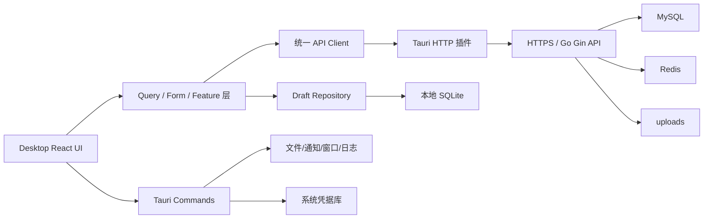
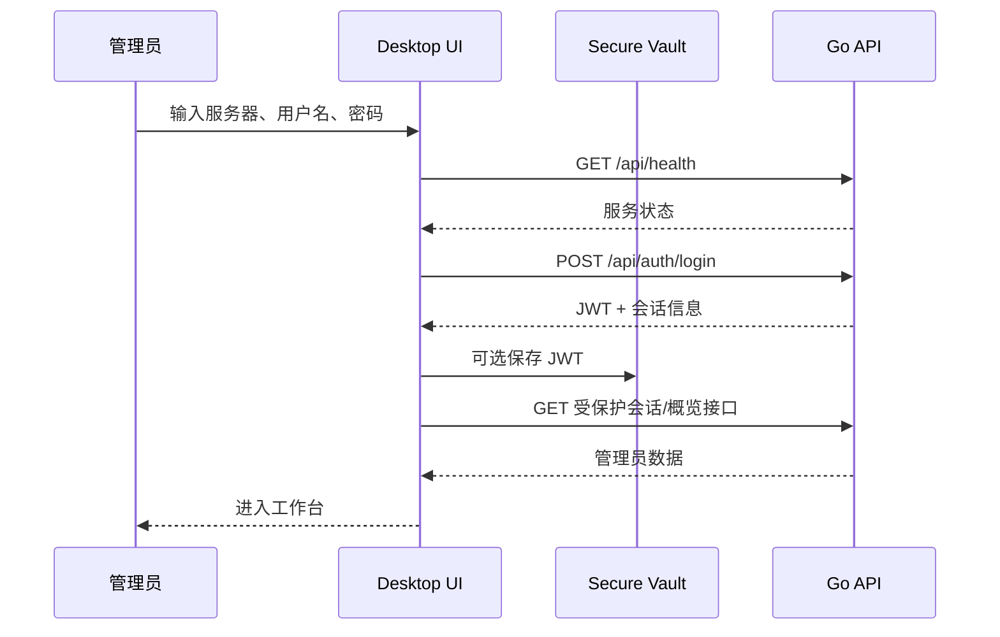

# 个人网站桌面管理端开发技术文档

> 文档状态：Draft v1.0  
> 编写日期：2026-07-14  
> 适用仓库：`personal-website`  
> 首发平台：Windows 10/11 x64  
> 后续平台：macOS，Linux 视需求评估

## 0. 文档结论

本项目的桌面端应定义为“个人网站桌面管理端”，而不是把公开网站直接套进桌面窗口。公开网站继续由现有 React Web 前端承载，桌面端服务于站长，负责文章、项目、资源、主题、音乐、Live2D、用户、安全和运维管理，并提供本地草稿、文件选择、通知、诊断和站点预览等桌面能力。

核心技术决策如下：

| 决策项 | 选择 | 说明 |
| --- | --- | --- |
| 桌面容器 | Tauri 2 | 安装包和内存占用较小，权限模型明确，支持签名更新和跨平台 |
| UI | React 18 + TypeScript + Vite | 与现有前端一致，降低迁移成本；新代码强制 TypeScript |
| UI 样式 | Tailwind CSS + CSS Design Tokens | 延续现有项目，同时建立稳定的桌面设计变量 |
| 路由 | React Router，使用 Hash Router | 避免桌面自定义协议下刷新和深链路问题 |
| 服务端状态 | TanStack Query | 统一请求缓存、失效、重试和加载状态 |
| 表单 | React Hook Form + Zod | 统一表单状态和边界校验 |
| 本地状态 | React state/context；复杂跨页状态才使用 Zustand | 防止引入不必要的全局状态 |
| 本地数据 | SQLite，仅保存草稿和非敏感客户端数据 | 远端 MySQL 仍是业务数据唯一真相源 |
| 敏感数据 | 系统凭据库 | 通过 Rust `keyring` 集成 Windows Credential Manager/macOS Keychain；JWT 不得进入 localStorage、日志或 SQLite 明文 |
| 远端通信 | Tauri HTTP 插件 + 统一 TypeScript API Client | 绕开 WebView CORS 差异，并集中处理鉴权和错误 |
| 业务后端 | 继续使用现有 Go/Gin API | 桌面端不直连 MySQL/Redis，也不内置完整 Go 服务 |
| 发布 | GitHub Actions + Tauri Bundler + 签名自动更新 | 首期产出 Windows MSI/NSIS 安装包 |

第一版不做完整离线镜像、不在客户端内置 MySQL/Redis、不执行用户上传的 HTML/JS、不复制一套桌面业务后端。

## 1. 背景与边界

### 1.1 现有系统基线

当前仓库已经具备：

- React 18、Vite、Tailwind CSS、React Router 和 Framer Motion 前端。
- Go、Gin、GORM、JWT、MySQL 后端。
- Redis 缓存、限流与部分统计能力。
- 公开站点、用户登录、评论和文章访问控制。
- 文章、项目、技能、能力卡片、个人资料、主题、音乐、Live2D、用户监控、安全和稳定性后台。
- 图片、音乐、歌词、主题背景和 Live2D 模型等上传能力。
- Docker/Nginx 生产部署方式。

现有后台 JSX 页面把界面、`fetch`、鉴权 token 和错误处理混在页面组件中，且使用 `sessionStorage` 和全局 `window.fetch` 拦截器。桌面端不能直接照搬这部分运行时设计，否则会继续放大接口不一致、错误状态分散和凭据泄露风险。

### 1.2 产品定位

桌面端的主要用户是网站管理员。主要使用场景：

1. 集中管理网站内容和媒体资源。
2. 使用本地文件选择器批量上传图片、音乐和 Live2D 模型。
3. 长时间编辑文章，并在断网或程序异常时保留本地草稿。
4. 查看用户、评论、访问安全和站点健康状态。
5. 在发布前预览内容，发布后打开公开站点验证。
6. 从本地导出备份、诊断日志和管理数据。

### 1.3 MVP 范围

MVP 包含：

- 服务器连接配置与连通性检查。
- 管理员登录、自动恢复会话、退出登录。
- 工作台概览。
- 文章列表、创建、编辑、删除、预览、本地自动草稿。
- 项目、技能、能力卡片和个人资料管理。
- 图片资源和主题背景上传。
- 主题配置。
- 用户、评论、安全与稳定性只读查看；已有接口支持的操作继续保留。
- 打开公开站点、导出管理数据、查看本地日志。
- Windows 安装包、应用签名准备和自动更新通道。

### 1.4 非目标

首版明确不包含：

- 将公开站点作为桌面端首页。
- 完整离线编辑所有业务对象或离线发布。
- 客户端直接连接 MySQL、Redis、服务器 SSH 或 Docker Socket。
- 在桌面主 WebView 中执行上传的静态站点 HTML/CSS/JS。
- 多管理员实时协同编辑。
- 插件市场和脚本执行系统。
- 自动部署或远程修改服务器环境变量。

## 2. UI 架构选型

### 2.1 桌面容器比较

| 维度 | Tauri 2 | Electron | Wails |
| --- | --- | --- | --- |
| 现有 React UI 复用 | 高 | 高 | 高 |
| 安装体积/内存 | 较低，使用系统 WebView | 较高，内置 Chromium | 较低，使用系统 WebView |
| 原生权限控制 | Capability/插件权限较完整 | 依赖主进程和 preload 自行治理 | Go binding 清晰，但生态较小 |
| 自动更新与签名 | 官方能力完整 | 生态成熟 | 通常需要更多自建工作 |
| 团队新增语言 | 少量 Rust | Node.js 主进程 | 可沿用 Go |
| 生态成熟度 | 高 | 最高 | 中等 |
| 本项目适配度 | **推荐** | 可用但偏重 | 次选，适合大量本地 Go 逻辑时 |

选择 Tauri 2 的原因：桌面壳只承担窗口、文件、凭据、更新和 HTTP 传输等能力，业务仍在远端 Go API，因此没有必要为了“复用 Go”再在客户端维护一套 Go 业务层。Tauri 的权限清单、签名更新和轻量分发更符合本项目。Rust 代码必须保持薄，禁止把远端业务规则复制进 `src-tauri`。

若后续确定桌面端必须内置完整本地服务、离线运行 Go 业务或大量复用 Go 包，再用 ADR 重新评估 Wails。不能在实现中同时维护 Tauri 和 Wails 两套壳。

### 2.2 UI 框架选择

选择 React 而不是迁移 Vue、Svelte 或原生 UI，原因是现有页面、交互和 Live2D 组件均基于 React/Web 技术。桌面端新建 TypeScript 工程，不继续扩展无类型的 JSX 页面。

复用原则：

- 可以复用：设计变量、图标选择、纯展示组件、Markdown 渲染规则、数据字段定义。
- 经改造后复用：编辑器、图片裁剪、Live2D 预览、主题预览。
- 不直接复用：页面内的请求代码、`sessionStorage` token、全局 `window.fetch` monkey patch、依赖浏览器同源路径的代码。
- 不允许从 `desktop/src` 使用 `../../frontend/src/...` 之类的跨工程相对导入。
- 真正稳定的共享代码后续提取到 `packages/`，且只能是无平台副作用的纯 TypeScript/React 模块。

### 2.3 推荐技术栈

版本采用“主版本锁定、补丁版本由 lockfile 固定”的方式，不在文档里固定尚未验证的补丁号。

| 层次 | 技术 |
| --- | --- |
| Desktop Runtime | Tauri 2.x、Rust stable |
| UI Runtime | React 18、TypeScript 5.x、Vite |
| Router | React Router 6.x，`createHashRouter` |
| Styling | Tailwind CSS 3.x、CSS Variables、lucide-react |
| Server State | `@tanstack/react-query` 5.x |
| Forms | `react-hook-form`、`zod`、`@hookform/resolvers` |
| Local Store | Zustand，仅在确有跨模块 UI 状态时使用 |
| Editor | 先复用并改造现有编辑器；评估后再决定 TipTap/CodeMirror |
| Markdown | `react-markdown`、`remark-gfm`、`rehype-highlight`、`rehype-sanitize` |
| Local Database | `tauri-plugin-sql` + SQLite |
| Secret Storage | Rust `keyring` + Windows Credential Manager/macOS Keychain |
| Native HTTP | `tauri-plugin-http` |
| Native Features | dialog、fs、shell/opener、notification、store、log、updater、process 插件 |
| Unit Test | Vitest、React Testing Library、MSW |
| E2E | Playwright 测 Web UI；Windows 上使用 Tauri WebDriver 做关键烟雾测试 |

引入新依赖时必须满足：仍在维护、许可证可接受、支持当前 Tauri/React 主版本、能通过依赖安全检查。不得为了一个简单控件引入整套 UI 框架。

## 3. 总体架构



### 3.1 分层职责

| 层 | 职责 | 禁止事项 |
| --- | --- | --- |
| UI/View | 布局、交互、无障碍、展示状态 | 直接拼接 API URL、直接读写 token |
| Feature | 用例编排、表单、权限判断、业务交互 | 访问其他 feature 内部文件 |
| API/Query | 请求、类型、缓存 key、失效策略、错误归一化 | 弹 Toast、控制路由 |
| Local Repository | 草稿、客户端设置、本地迁移 | 保存远端密码、把本地缓存当真相源 |
| Tauri Host | 原生权限、窗口、HTTP、文件、更新、日志 | 复制文章发布等服务端业务规则 |
| Go API | 鉴权、业务校验、持久化、审计、缓存 | 信任客户端校验结果 |

### 3.2 进程与信任边界

桌面 UI 运行在 WebView 中，默认视为不可信展示层。Rust Host 是受控原生边界，Go API 是业务授权边界。任何删除、发布、账号修改、限流设置等操作，必须由 Go API 重新鉴权和校验。

WebView 不能获得任意文件系统、任意命令执行或任意外部 URL 权限。Tauri capability 按窗口和插件最小授权。所有外部链接默认交给系统浏览器打开。

## 4. 桌面 UI 信息架构

### 4.1 应用壳

第一版采用单主窗口、原生标题栏。不要一开始实现自绘标题栏，因为它会额外引入窗口拖拽、缩放、系统菜单、DPI 和无障碍问题。

主窗口结构：

```text
┌──────────────────────────────────────────────────────────────┐
│ 原生标题栏                                                   │
├──────────────┬───────────────────────────────────────────────┤
│              │ 页面标题 / 面包屑          全局搜索  同步状态 │
│  主导航      ├───────────────────────────────────────────────┤
│  232px       │                                               │
│              │ 主工作区                                      │
│              │                                               │
│              ├───────────────────────────────────────────────┤
│ 账号/设置    │ 可选状态栏：环境、API 状态、版本               │
└──────────────┴───────────────────────────────────────────────┘
```

窗口约束：

- 默认尺寸：`1440 × 900`。
- 最小尺寸：`1100 × 720`。
- 记住上次尺寸、位置和最大化状态，但恢复时必须校验当前显示器可见区域。
- 首版单实例运行；第二次启动时激活已有窗口。
- 关闭文章编辑窗口前检查未保存草稿。
- 不用视口宽度连续缩放字体；通过固定字号、密度档位和布局断点适配。

### 4.2 导航分组

| 分组 | 页面 | 路由 |
| --- | --- | --- |
| 工作台 | 概览 | `/` |
| 内容 | 文章 | `/content/articles` |
| 内容 | 项目 | `/content/projects` |
| 内容 | 技能 | `/content/skills` |
| 内容 | 能力卡片 | `/content/feature-cards` |
| 资源 | 图片资源 | `/assets/images` |
| 资源 | 主题 | `/assets/themes` |
| 资源 | 音乐 | `/assets/music` |
| 资源 | Live2D | `/assets/live2d` |
| 社区 | 用户与评论 | `/community` |
| 运维 | 稳定性 | `/operations/stability` |
| 运维 | 访问安全 | `/operations/security` |
| 设置 | 个人资料 | `/settings/profile` |
| 设置 | 上传限制 | `/settings/uploads` |
| 设置 | 账号安全 | `/settings/account` |
| 设置 | 连接与应用 | `/settings/application` |

导航项超过主窗口高度时只让导航区滚动，底部账号与设置入口固定。图标统一使用 Lucide，不手绘 SVG。导航文案保持名词化，动作放到页面工具栏。

### 4.3 页面模板

管理页面统一使用以下模板，避免每个模块自行设计：

1. `ListPage`：页面标题、筛选工具栏、表格/列表、分页和批量操作。
2. `EditorPage`：编辑区、预览区、保存状态和发布动作。
3. `SettingsPage`：按主题分组的设置表单，页面底部或吸底工具栏保存。
4. `MonitoringPage`：时间范围、核心指标、事件表格和详情抽屉。
5. `AssetPage`：文件列表/网格、上传队列、元数据和预览。

页面 section 使用无框布局；卡片只用于可重复条目、指标块、模态框和确实需要边界的工具。禁止在卡片里再套卡片。

### 4.4 关键页面设计

#### 工作台

- 顶部展示 API、数据库、Redis、上传目录状态，数据来自 `/api/health` 和 `/api/health/full`。
- 展示文章、项目、用户、待审评论等摘要。
- 展示最近操作日志和最近本地草稿。
- 快捷动作仅保留“新建文章”“上传资源”“打开站点”。
- 健康检查失败时展示可操作错误，不自动循环弹窗。

#### 文章工作区

- 左侧或独立列表页：搜索、分类、标签、发布状态和排序。
- 编辑器页：标题与元数据、正文编辑、实时预览、发布设置。
- 每 3 秒 debounce 保存本地草稿；失焦和窗口关闭前强制 flush。
- 远端保存成功后记录服务端版本或 `updatedAt`。
- 本地草稿、远端已保存、远端发布是三个不同状态，UI 不得混用一个“已保存”。
- 图片上传完成后由 API 返回 URL，统一经过 `resolveAssetUrl` 处理。
- 静态 HTML/CSS/JS 文章只能上传和在系统浏览器中预览，不能在管理主 WebView 内执行。

#### 资源页面

- 上传使用文件选择器，也支持经过验证的拖放区域。
- 上传队列必须显示文件名、类型、大小、进度、状态、取消和重试。
- Live2D、音乐等大文件逐个或受控并发上传，默认并发数不超过 2。
- 删除操作展示资源引用信息；服务端无法判断引用时明确提示风险。
- 图片网格使用稳定 `aspect-ratio`，加载和失败状态不能造成布局跳动。

#### 运维页面

- 指标、日志和事件以扫描效率为主，使用紧凑表格，不使用营销式大标题。
- 危险设置修改要求二次确认，并显示变更前后值。
- 导出操作使用原生保存对话框，不把大文件完整放进 JS 内存。

### 4.5 交互状态规范

每个异步页面必须显式处理：

- `initial loading`：骨架屏，不展示空白页。
- `refreshing`：保留已有数据，只显示轻量刷新状态。
- `empty`：说明当前为空并给出唯一主要动作。
- `validation error`：字段附近提示。
- `request error`：保留用户输入，提供重试或恢复路径。
- `offline`：禁止会失败的发布操作，但允许继续编辑本地草稿。
- `unauthorized`：清除内存会话并回到登录页，不重复弹多条错误。
- `conflict`：展示本地和远端更新时间，允许比较、覆盖或另存草稿。

Toast 只用于无需用户立即处理的短反馈。删除确认、冲突解决、凭据失效等必须用明确的对话框或页面状态。

### 4.6 Design Tokens

桌面端不直接复制公开站点的动态主题作为管理界面底色。管理 UI 使用安静、清晰的中性色，用户主题只在预览区域显示。

建议变量：

```css
:root {
  --color-bg: #f6f7f9;
  --color-surface: #ffffff;
  --color-surface-subtle: #f0f2f5;
  --color-text: #17191c;
  --color-text-muted: #626872;
  --color-border: #dfe3e8;
  --color-primary: #2563eb;
  --color-success: #16803a;
  --color-warning: #b45309;
  --color-danger: #c52a2a;
  --radius-control: 6px;
  --radius-panel: 8px;
  --sidebar-width: 232px;
  --toolbar-height: 52px;
  --statusbar-height: 28px;
}
```

暗色模式另设语义变量，不通过对所有元素加透明度实现。字距保持 `0`。表格、工具栏、按钮、输入框必须有稳定高度，加载文案和图标不能引发布局位移。

### 4.7 无障碍与键盘

- 所有图标按钮有可访问名称和 tooltip。
- 焦点样式清晰可见，不用 `outline: none` 直接移除。
- 弹窗实现焦点锁定、Esc 关闭和关闭后焦点归还。
- 表格操作可通过键盘到达；颜色不是状态的唯一表达方式。
- 尊重 `prefers-reduced-motion`，关闭大范围位移动画和粒子效果。
- 文本、控件和错误状态达到 WCAG 2.1 AA 对比度目标。
- 常用快捷键在菜单和命令面板中定义，事件绑定集中管理，禁止页面各自监听全局按键。

## 5. 前端代码架构

### 5.1 推荐目录

```text
personal-website/
├─ desktop/
│  ├─ package.json
│  ├─ vite.config.ts
│  ├─ tsconfig.json
│  ├─ src/
│  │  ├─ app/
│  │  │  ├─ App.tsx
│  │  │  ├─ router.tsx
│  │  │  ├─ providers.tsx
│  │  │  └─ error-boundary.tsx
│  │  ├─ layouts/
│  │  │  ├─ AppShell.tsx
│  │  │  ├─ AuthLayout.tsx
│  │  │  └─ EditorLayout.tsx
│  │  ├─ features/
│  │  │  ├─ auth/
│  │  │  ├─ dashboard/
│  │  │  ├─ articles/
│  │  │  ├─ projects/
│  │  │  ├─ skills/
│  │  │  ├─ feature-cards/
│  │  │  ├─ assets/
│  │  │  ├─ themes/
│  │  │  ├─ music/
│  │  │  ├─ live2d/
│  │  │  ├─ community/
│  │  │  ├─ security/
│  │  │  └─ settings/
│  │  ├─ shared/
│  │  │  ├─ api/
│  │  │  ├─ components/
│  │  │  ├─ hooks/
│  │  │  ├─ lib/
│  │  │  ├─ styles/
│  │  │  └─ types/
│  │  └─ test/
│  ├─ src-tauri/
│  │  ├─ capabilities/
│  │  ├─ migrations/
│  │  ├─ src/
│  │  │  ├─ commands/
│  │  │  ├─ security/
│  │  │  ├─ state.rs
│  │  │  ├─ lib.rs
│  │  │  └─ main.rs
│  │  ├─ Cargo.toml
│  │  └─ tauri.conf.json
│  └─ tests/
├─ packages/                 # 确有两个消费者后再创建
│  ├─ contracts/
│  └─ ui/
├─ frontend/
├─ go_back/
└─ docs/
```

每个 feature 内部建议使用：

```text
features/articles/
├─ api.ts
├─ keys.ts
├─ queries.ts
├─ schema.ts
├─ types.ts
├─ components/
├─ pages/
└─ __tests__/
```

### 5.2 导入边界

- `app` 可以组合 `layouts`、`features` 和 `shared`。
- `layouts` 可以依赖 `shared`，不依赖具体 feature 的内部实现。
- `features/*` 可以依赖 `shared`，跨 feature 协作通过公开 `index.ts` 或 app 层编排。
- `shared` 不得反向依赖 `features`、`layouts` 或 `app`。
- 禁止一个 feature 导入另一个 feature 的 `components/internal`、`api` 私有文件。
- `src-tauri` 与 React 仅通过类型明确的 command/event 接口交互。

路径别名至少配置 `@app`、`@features`、`@shared`。不要为每一层级建立大量别名。

### 5.3 状态分层

| 状态类型 | 工具 | 示例 |
| --- | --- | --- |
| 组件瞬时状态 | `useState`/`useReducer` | 对话框开关、当前 Tab |
| URL 状态 | Router search params | 页码、筛选、排序、选中条目 |
| 表单状态 | React Hook Form | 文章编辑、主题设置 |
| 服务端状态 | TanStack Query | 文章列表、站点统计、安全日志 |
| 跨页 UI 状态 | Context/Zustand | 当前服务器配置、侧栏折叠、上传队列 |
| 本地持久化 | SQLite/Store | 草稿、窗口偏好、非敏感设置 |
| 敏感会话 | 内存 + 系统凭据库 | JWT |

不得把服务端响应复制进 Zustand。列表筛选能表达在 URL 时，不放全局 store。Query key 由各 feature 的 `keys.ts` 统一生成。

### 5.4 路由与权限

路由使用 `createHashRouter`。顶层守卫只判断：

1. 是否已完成连接配置。
2. 是否有可恢复会话。
3. 当前会话是否通过一次轻量受保护请求验证。

页面权限不是安全边界；服务端继续执行 ADMIN 角色校验。路由懒加载按 feature 切分，不把 Markdown、Live2D、图表和编辑器全部打入首屏。

### 5.5 API Client

所有远端请求必须经过一个统一客户端：

```ts
export interface ApiError {
  status: number
  code?: string
  message: string
  requestId?: string
  retryAfterSeconds?: number
  fieldErrors?: Record<string, string>
}

export interface RequestOptions<TBody> {
  method?: 'GET' | 'POST' | 'PUT' | 'PATCH' | 'DELETE'
  body?: TBody
  signal?: AbortSignal
  timeoutMs?: number
}
```

客户端负责：

- 使用配置后的 `apiOrigin` 解析相对路径。
- 注入 `Authorization: Bearer <token>`。
- JSON/FormData 编码。
- 连接、超时、HTTP、解析和业务错误归一化。
- 解析 `Retry-After`、`X-Request-ID`。
- 401 时只触发一次会话失效事件。
- 默认超时；大文件上传单独配置。
- 对 GET 允许有限重试；POST/PUT/DELETE 默认不自动重试。

客户端不负责 Toast、跳路由或 Query cache 操作。禁止重写全局 `window.fetch`。

### 5.6 Query 约定

- 列表 key 示例：`['articles', 'list', normalizedFilters]`。
- 详情 key 示例：`['articles', 'detail', articleId]`。
- mutation 成功后精确更新详情并失效相关列表，避免全局清空缓存。
- `staleTime` 按领域设置：设置类可较长，安全日志和健康状态较短。
- 窗口重新聚焦不应无条件刷新所有大列表。
- 删除采用服务端成功后更新，不对危险操作做乐观更新。
- 编辑保存可使用 mutation，但本地草稿保存不进入 Query cache。

### 5.7 表单约定

- Zod schema 是客户端输入边界，不替代服务端校验。
- API DTO 与 Form Model 分离，转换函数集中在 feature 中。
- 后端字段错误映射到对应控件；未知错误显示在表单级错误区。
- 离开脏表单前提示，保存失败不清空输入。
- 所有日期在 API 边界使用 RFC 3339，UI 按 Asia/Shanghai 展示；不要传本地化日期字符串。

### 5.8 错误边界

至少设置三层：

- 应用级 Error Boundary：提供重载 UI、打开日志目录、导出诊断。
- 路由级 Error Boundary：单页面失败不让整个窗口白屏。
- 高风险组件边界：Markdown/Live2D/图表预览失败可独立降级。

错误页不得展示 token、完整请求体、服务器堆栈或本地绝对敏感路径。

## 6. Tauri Host 架构

### 6.1 Host 职责

Rust/Tauri 仅负责：

- 单实例与窗口状态。
- 原生打开/保存/文件选择对话框。
- 受限文件读取和流式上传/下载。
- 通过经过评审的 Rust `keyring` 集成访问系统凭据库。
- 本地 SQLite 初始化和迁移。
- 系统通知。
- 应用日志和脱敏诊断导出。
- 外部浏览器打开 URL。
- 签名更新检查、下载和重启安装。

不得在 Host 中实现“文章能否发布”“用户能否封禁”等业务规则。

### 6.2 Command 设计

命令必须细粒度、类型明确，不提供通用 `execute`、任意 shell、任意路径读写或任意 HTTP 代理命令。

建议命令：

```text
credential_get(profile_id)
credential_set(profile_id, token)
credential_delete(profile_id)
window_restore_state()
window_save_state(state)
draft_flush(draft)
diagnostics_export(target_path)
open_external_url(validated_url)
upload_file(request)          # 仅在插件 HTTP 无法满足进度时实现
download_export(request)
```

每个 command 的输入在 Rust 端再次校验。文件路径必须来自应用已授权目录或当前文件选择器返回值。URL 只允许 `https`，开发模式额外允许 `http://127.0.0.1` 和 `http://localhost`。

### 6.3 Event 设计

事件用于 Host 主动通知 UI：

```text
app://update-available
app://upload-progress
app://download-progress
app://session-invalidated
app://deep-link
app://window-close-requested
```

事件 payload 必须定义 TypeScript/Rust 对应类型。组件卸载时注销监听，避免重复回调和内存泄漏。

### 6.4 Capability 最小化

能力按主窗口配置。第一版原则：

- dialog：仅开放所需 open/save。
- fs：只开放 app data、app log、用户通过对话框选择的文件。
- shell/opener：只允许 `http`/`https`，Host 侧仍验证域名和 scheme。
- http：生产只允许已配置的 HTTPS 站点；开发允许 localhost。
- process：仅允许应用自身重启，不允许任意子进程。
- updater：只连接固定更新源并验证签名。
- 禁止 shell command、任意目录遍历和未使用插件权限。

开发和生产 capability 分开配置，不能把开发期通配符带进发布包。

## 7. 后端 API 集成

### 7.1 连接模型

桌面端保存一个 `ServerProfile`：

```ts
interface ServerProfile {
  id: string
  name: string
  origin: string       // 例如 https://example.com
  apiBasePath: '/api'
  websiteUrl: string
  createdAt: string
  lastConnectedAt?: string
}
```

生产环境强制 HTTPS。用户输入 origin 后进行规范化：移除末尾 `/`，禁止查询串和 fragment，禁止嵌入用户名密码。连接测试顺序：

1. `GET /api/health`，确认 HTTP 与 JSON 格式。
2. 校验服务标识/兼容版本；服务端尚无该字段时先记录为待改造项。
3. 登录后请求一个轻量受保护接口确认管理员权限。
4. 需要时请求 `/api/health/full` 展示依赖状态。

### 7.2 现有接口映射

桌面端第一阶段可直接使用以下现有接口：

| 领域 | 接口前缀/示例 |
| --- | --- |
| 登录 | `POST /api/auth/login` |
| 健康 | `GET /api/health`、`GET /api/health/full` |
| 文章 | `/api/admin/articles`、`/api/admin/article-images`、`/api/admin/article-sites` |
| 项目 | `/api/admin/projects` |
| 技能 | `/api/admin/skills` |
| 能力卡片 | `/api/admin/feature-cards` |
| 个人资料 | `/api/admin/profile` |
| 上传设置 | `/api/admin/upload-settings`、`/api/admin/upload-assets/cleanup` |
| 工作台/运维 | `/api/admin/dashboard-stats`、`/api/admin/operation-logs`、`/api/admin/export` |
| 搜索 | `/api/admin/search` |
| 安全 | `/api/admin/security`、`/api/admin/security/rate-limit-settings` |
| 用户与评论 | `/api/admin/users`、`/api/admin/user-activities`、`/api/admin/comments` |
| 主题 | `/api/admin/theme`、`/api/admin/themes` |
| Live2D | `/api/admin/live2d-models`、`/api/admin/live2d-settings` |
| 音乐 | `/api/admin/music` |
| 账号 | `PUT /api/admin/account/password` |

所有 `/api/admin/*` 请求继续使用现有 Bearer JWT。桌面端不得使用普通用户 Cookie 模拟管理员会话。

### 7.3 建议新增或改造的 API

以下是桌面 MVP 前应优先补齐的服务端契约：

| 优先级 | 改造 | 目的 |
| --- | --- | --- |
| P0 | `GET /api/meta` 返回 `service`、`apiVersion`、`minDesktopVersion`、`serverTime` | 防止桌面端连到错误服务或不兼容版本 |
| P0 | 登录响应增加 `expiresAt`、`user`，或新增 `GET /api/admin/session` | 不让客户端自行猜测身份与会话状态 |
| P0 | 全局返回/透传 `X-Request-ID` | 串联桌面日志和服务端日志 |
| P0 | 错误响应统一 `code`、`message`、可选 `fields` | UI 能稳定处理限流、冲突和字段错误 |
| P1 | 更新接口支持版本字段或 `If-Match` | 防止多个窗口/设备静默覆盖内容 |
| P1 | 上传响应统一资源 ID、URL、MIME、size、checksum | 支持上传队列和资源复用 |
| P1 | 导出接口提供文件名、大小和流式响应 | 避免大文件进入 JS 内存 |
| P2 | 分页参数和响应结构统一 | 降低各管理模块的适配代码 |

建议错误格式：

```json
{
  "code": "ARTICLE_VERSION_CONFLICT",
  "message": "文章已在其他位置更新",
  "requestId": "01J...",
  "fields": {
    "title": "标题不能为空"
  }
}
```

### 7.4 API 版本策略

当前 `/api` 路径不带版本。桌面端发布后升级节奏与服务器可能不同，必须建立兼容规则：

- `apiVersion` 使用整数能力版本，不与应用 SemVer 混用。
- 服务端至少兼容当前和前一个桌面 API 能力版本。
- 破坏性字段变化先新增后弃用，不直接改含义。
- 桌面端连接时检查 `minDesktopVersion`，不兼容则停止写操作并提示升级。
- 对现有 API 的响应建立契约测试，避免后端重构静默破坏桌面端。

### 7.5 资源 URL

服务端可能返回 `/uploads/...` 相对地址，也可能返回签名 `/api/...` 地址。所有 URL 统一走：

```ts
resolveAssetUrl(apiOrigin, value)
```

规则：

- 已是合法 `https://` 且属于当前服务器时原样使用。
- `/` 开头的路径以 `apiOrigin` 解析。
- 拒绝 `javascript:`、`data:text/html`、`file:` 等 scheme。
- 需要鉴权的音乐、文章站点资源不持久化过期签名 URL。
- UI 不能直接将服务端 URL 填入可执行 iframe。

### 7.6 上传与下载

小文件可使用 HTTP 插件发送 multipart。音乐、Live2D、导出包等大文件必须满足：

- 流式读取，避免一次性复制到 JS 和 Rust 两份内存。
- 支持进度、取消、超时和明确失败原因。
- 不自动重试非幂等上传；由用户确认重试。
- 服务端继续校验扩展名、MIME、magic bytes、大小和解压路径。
- ZIP 解压必须防 Zip Slip、压缩炸弹和符号链接逃逸。
- 下载先写临时文件，校验完成后原子移动到目标路径。

### 7.7 CORS 与 Origin

桌面请求通过 Tauri 原生 HTTP 发出时不依赖浏览器 CORS。现有 Go `CORS_ALLOWED_ORIGINS` 继续服务 Web 前后端分离场景，不应为桌面端直接改成 `*`。

若某个功能退回 WebView 原生 `fetch`，必须明确桌面 origin 并在服务端白名单中精确配置；不能用放宽全站 CORS 解决。登录和管理接口始终要求 Bearer JWT。

## 8. 登录、会话与凭据

### 8.1 登录流程



密码只存在于登录表单内存中，请求完成后清空，不保存。默认 JWT 只放内存；用户显式开启“保持登录”时才通过 Rust command 写入 Windows Credential Manager，macOS 版本对应写入 Keychain。若后续需要保存多种结构化秘密，再单独评估 Stronghold，不能用应用硬编码密码保护 Stronghold。

### 8.2 会话恢复

启动时：

1. 读取最后使用的 ServerProfile。
2. 从安全凭据库读取该 profile 对应 token。
3. 检查 JWT `exp` 只用于快速判断是否明显过期，不能据此信任权限。
4. 向服务端发起受保护请求验证。
5. 401 则删除 token 并进入登录页；网络失败则进入离线草稿模式，不误删尚可能有效的 token。

### 8.3 退出与失效

- 当前后端没有管理员 logout/revoke 接口，首版退出是删除本地 token。
- 修改管理员密码后，现有后端的密码指纹会使旧管理员 JWT 失效，这是正确行为。
- 401 处理必须 single-flight，避免多个并发请求触发多个登录弹窗。
- 403 表示已登录但无权或安全策略拒绝，不能一律当作 token 失效。
- 429 显示服务端限流信息和可重试时间，不自动高频重试。

## 9. 本地数据与离线策略

### 9.1 真相源

- 已发布业务数据：远端 MySQL/API 是唯一真相源。
- 未发布文章草稿：本地 SQLite 可以是临时真相源。
- Query 缓存：只用于会话内性能，不承诺离线持久化。
- 用户凭据：安全凭据库是唯一持久化位置。
- 应用设置：Tauri Store 或 SQLite，不能混存同一类数据。

### 9.2 SQLite 表

首版只建立必要表：

```sql
CREATE TABLE local_drafts (
  id TEXT PRIMARY KEY,
  server_profile_id TEXT NOT NULL,
  remote_type TEXT NOT NULL,
  remote_id TEXT,
  title TEXT NOT NULL DEFAULT '',
  payload_json TEXT NOT NULL,
  base_remote_version TEXT,
  base_remote_updated_at TEXT,
  local_updated_at TEXT NOT NULL,
  sync_state TEXT NOT NULL,
  last_error TEXT
);

CREATE INDEX idx_local_drafts_profile_updated
  ON local_drafts(server_profile_id, local_updated_at DESC);

CREATE TABLE app_migrations (
  version INTEGER PRIMARY KEY,
  applied_at TEXT NOT NULL
);
```

`payload_json` 仍需经过 schema version 管理。数据库迁移只前进，不在应用启动时做破坏性重建。

### 9.3 自动保存

- 内容变更后 3 秒 debounce。
- 应用失焦、切换文章、关闭窗口前立即 flush。
- 每次保存使用事务和 upsert。
- 保存失败时保留内存内容并显示持久化失败状态。
- 草稿保留策略默认 30 天；有未同步修改的草稿不能自动删除。
- 定期保留有限历史快照可以放到后续版本，首版避免无限增长。

### 9.4 冲突处理

远端对象必须逐步增加 `version` 或可靠的 `updatedAt`。保存时提交 base version：

- 版本一致：正常更新。
- 版本冲突：服务端返回 409 和最新版本摘要。
- UI 提供“查看差异”“用本地覆盖”“保留远端并另存本地草稿”。
- 默认不自动覆盖，也不尝试对富文本/Markdown 进行无提示自动合并。

完整离线 outbox 暂缓。删除、密码修改、安全设置等危险操作永不进入离线队列。

## 10. 安全设计

### 10.1 威胁模型

主要风险：

- XSS 窃取管理员 JWT。
- 恶意 Markdown、图片 URL、静态站点包或 Live2D 资源攻击 WebView。
- Tauri capability 过宽导致任意文件读取或命令执行。
- HTTP 明文或错误服务器地址导致凭据泄露。
- 更新包被替换。
- 日志、崩溃报告或诊断包泄露 token/密码。
- 本地草稿被同机其他用户读取。

### 10.2 必须执行的控制

- 生产连接仅 HTTPS；证书错误不可忽略。
- JWT 只在内存和安全凭据库中，不进 localStorage、sessionStorage、SQLite、URL 和日志。
- React 不使用未审查的 `dangerouslySetInnerHTML`。
- Markdown 启用 `rehype-sanitize`，自定义 schema 只放行必要标签和属性。
- 上传静态站点不在主 WebView 执行；公开预览用系统浏览器。
- CSP 禁止 `unsafe-eval`，逐步移除 `unsafe-inline`。
- 外部链接统一验证后交给系统浏览器。
- Tauri command 和 capability 按最小权限配置。
- 自动更新强制验签，更新公钥随应用发布，私钥只存在 CI Secret。
- 依赖锁文件提交仓库，CI 执行前端和 Rust 依赖审计。
- 日志脱敏 Authorization、Cookie、password、token、signed URL 和请求体。
- 诊断导出前展示将包含的文件，不包含数据库草稿正文，除非用户明确选择。

### 10.3 CSP 基线

具体值在实现时根据 Tauri dev/prod origin 校验，生产目标至少满足：

```text
default-src 'self';
script-src 'self';
style-src 'self' 'unsafe-inline';
img-src 'self' asset: https: data:;
font-src 'self' data:;
connect-src ipc: http://ipc.localhost https://固定API域名;
frame-src 'none';
object-src 'none';
base-uri 'none';
form-action 'self';
```

Tailwind/React 是否需要调整 `style-src` 应通过打包产物验证。不能为了快速修复资源加载问题把 `default-src` 改成 `*`。

### 10.4 本地数据保护

SQLite 草稿不含密码和 token。若草稿内容本身敏感，后续可增加数据库字段级加密；第一版至少确保 app data 目录权限仅当前用户可读，并在锁屏/切换用户场景不展示内容预览通知。

## 11. 性能与资源预算

### 11.1 启动目标

在常规 Windows 11、SSD 环境下：

- 冷启动到可交互壳：目标小于 2.5 秒。
- 恢复本地会话不阻塞壳渲染；网络状态异步呈现。
- 首屏 JS gzip 目标小于 500 KB，不含按需编辑器/Live2D chunk。
- 空闲主窗口内存目标小于 250 MB，实际以 WebView2 基线测试为准。

这些是工程目标，不作为没有测量依据的硬承诺。CI 或发布验收记录真实设备数据。

### 11.2 优化策略

- 路由级懒加载编辑器、Markdown、图表、Live2D。
- 大列表使用服务端分页；超过约 200 行且确有卡顿时再引入虚拟化。
- 搜索 250-400ms debounce，并取消过期请求。
- 图片生成缩略图并使用稳定尺寸，避免解码完整大图作为列表封面。
- 上传并发受控，大文件流式传输。
- TanStack Query 避免焦点恢复时刷新全部页面。
- Live2D 只在预览页加载，离开页面时释放纹理、事件和 canvas。
- 性能优化前记录启动、路由切换、编辑输入延迟和内存快照。

## 12. 可观测性与诊断

### 12.1 本地日志

日志分为：

- `app.log`：启动、窗口、更新、迁移、未捕获错误。
- `network.log`：请求方法、路径模板、状态码、耗时、request ID；不记录 query secret 和 body。
- `upload.log`：文件类型、大小、进度和错误；文件名按隐私设置脱敏。

使用滚动日志，建议单文件 5-10 MB、保留 5 份。生产默认 `info`，用户临时开启 debug 后自动在 24 小时内恢复。

### 12.2 关联与指标

- 客户端生成或传递 `X-Request-ID`。
- 服务端日志同步记录该 ID。
- 记录启动耗时、API 延迟分布、失败率、上传失败和本地迁移失败。
- 默认不接入第三方遥测；如引入崩溃平台，必须明确隐私说明并允许关闭。

### 12.3 诊断包

诊断包包含：应用版本、OS/WebView 版本、非敏感配置摘要、最近脱敏日志、数据库 migration 版本和服务器 `/api/meta` 信息。不得包含 JWT、密码、草稿正文、上传文件内容或完整用户数据。

## 13. 测试策略

### 13.1 测试金字塔

| 层 | 工具 | 重点 |
| --- | --- | --- |
| TypeScript 单元测试 | Vitest | URL 解析、DTO 转换、schema、错误归一化、冲突判断 |
| React 组件测试 | Testing Library + MSW | 表单、异步状态、权限失效、上传队列 |
| Rust 单元测试 | `cargo test` | URL/路径校验、脱敏、凭据 key、诊断过滤 |
| API 契约测试 | Go tests + 固定响应样例 | 登录、分页、错误结构、上传响应 |
| Web UI E2E | Playwright | 登录、文章编辑、删除确认、离线草稿恢复 |
| Packaged App Smoke | Tauri WebDriver/人工检查 | 安装、启动、更新、文件对话框、系统浏览器、单实例 |

### 13.2 必测用例

- 正确登录、错误密码、429、过期 token、修改密码后 token 失效。
- API 离线、超时、非 JSON 502、返回字段缺失。
- 文章自动保存、进程异常后恢复、远端 409 冲突。
- 上传超限、MIME 不符、取消、网络中断、重试。
- 删除二次确认和服务端删除失败。
- 相对/绝对资源 URL、危险 scheme 拒绝。
- Markdown XSS、恶意链接、超大文档。
- SQLite 首次迁移、跨版本迁移失败后的恢复。
- 更新签名错误、下载失败、用户延后更新。
- 100%、125%、150% DPI 和最小窗口尺寸。
- 浅色、深色、键盘导航和 reduced motion。

### 13.3 测试门禁

Pull Request 至少通过：

```text
npm run lint
npm run typecheck
npm run test
npm run build
cargo fmt --check
cargo clippy -- -D warnings
cargo test
go test ./...
```

具体脚本由脚手架阶段写入 `desktop/package.json` 和 CI。发布候选包增加 Windows 安装与关键烟雾测试。

## 14. 构建、签名与发布

### 14.1 环境

Windows 开发机需要：

- Node.js 当前受支持的 LTS。
- Rust stable 与 `rustup`。
- Visual Studio Build Tools 的 Desktop development with C++。
- WebView2 Runtime。
- Tauri CLI 2.x。
- Go 与现有后端开发环境。

版本写入并锁定：

- Node 使用 `.nvmrc` 或 Volta。
- Rust 使用 `rust-toolchain.toml`。
- npm 使用 `package-lock.json`。
- Rust 使用 `Cargo.lock`。

### 14.2 应用标识

发布前确定且不再随意修改：

```text
Product Name: Personal Website Studio
Bundle ID: com.<owner>.personalwebsitestudio
Executable: personal-website-studio
Update Channel: stable / beta
```

显示名可以调整，Bundle ID、签名身份和 updater 公钥变更会影响升级链路，必须使用 ADR 管理。

### 14.3 版本策略

- 应用版本采用 SemVer。
- `MAJOR`：本地数据或服务器兼容性发生重大变化。
- `MINOR`：新增向后兼容能力。
- `PATCH`：修复和小改进。
- beta 使用预发布标识，例如 `1.2.0-beta.1`。
- 应用版本、Tauri 配置、Cargo package 和前端 package 由脚本统一校验。

### 14.4 CI/CD

建议流水线：

1. `verify`：lint、typecheck、unit、Go test、Rust test、依赖审计。
2. `build-windows`：在固定 Windows runner 构建签名安装包。
3. `smoke`：安装并执行基础启动/登录 mock 测试。
4. `sign`：代码签名和 Tauri updater 签名。
5. `publish-beta`：生成 beta 更新 manifest 和 release notes。
6. `promote-stable`：人工批准后发布 stable。

签名私钥、证书密码和 updater 私钥只放 CI Secret。构建日志不能输出 secret。正式包需要 Windows Authenticode 代码签名，否则 SmartScreen 会显著影响安装体验。

### 14.5 自动更新

- 应用启动后延迟检查，不阻塞首屏。
- 下载前展示版本和 release notes。
- 更新包必须验签。
- 编辑器存在未保存草稿时禁止自动重启。
- 数据库迁移必须兼容从仍受支持的最老版本直接升级。
- 更新失败保留当前可运行版本和日志，不能让应用进入启动循环。

## 15. 开发工作流

### 15.1 本地运行

目标脚本：

```powershell
# 终端 1：启动现有 Go API
Set-Location go_back
go run ./cmd/server

# 终端 2：启动桌面端
Set-Location desktop
npm install
npm run tauri dev
```

开发配置允许 `http://127.0.0.1:8080`，生产构建禁用明文地址。前端测试使用 MSW，不要求所有组件测试都启动真实 MySQL。

### 15.2 分支与提交

- 功能以垂直切片交付，例如“文章列表从 API 到 UI”，避免先铺完整空目录再长期不闭环。
- 数据库 migration、API 契约和 UI 适配在同一个变更中可验证。
- 修改安全权限、更新、凭据或 URL 校验必须单独指出风险和测试证据。
- 依赖升级与功能开发分开提交，便于回滚和审计。

### 15.3 Definition of Done

一个桌面功能完成必须满足：

- 正常、加载、空、错误、离线和无权限状态已处理。
- 类型和服务端契约明确，没有页面内散落的 URL 和 token 读取。
- 关键逻辑有自动化测试。
- 键盘和最小窗口尺寸可用。
- 日志不包含敏感数据。
- API mutation 有服务端成功/失败反馈和缓存失效策略。
- 文档、migration、权限清单随代码更新。

## 16. 分阶段实施计划

### 阶段 0：架构验证与契约基线

产出：

- 创建 `desktop/` Tauri 2 + React + TypeScript 最小工程。
- 验证 Windows WebView2 下 React、Tailwind、Hash Router、Markdown 和 Live2D 基础兼容性。
- 建立 API Client，打通 `/api/health` 和 `/api/auth/login`。
- 建立 `api/meta`、会话和错误格式的后端改造方案。
- 建立 lint、typecheck、test、Rust clippy 和基础 CI。

退出条件：开发包可启动，可连接本地 Go API，可登录，可安全保存/删除测试 token，无 capability 通配符进入生产配置。

### 阶段 1：应用壳与工作台

产出：

- AppShell、导航、路由、主题、错误边界。
- ServerProfile 配置与连接检查。
- 会话恢复、401 single-flight、退出登录。
- 工作台指标、健康状态、最近操作。
- 窗口状态、单实例、日志和诊断入口。

退出条件：断网、超时、错误密码、过期 token 和服务端 500 均有稳定恢复路径。

### 阶段 2：内容管理 MVP

产出：

- 文章列表、筛选、分页、创建、编辑、删除。
- Markdown 安全预览和图片上传。
- SQLite migration、本地草稿和崩溃恢复。
- 项目、技能、能力卡片、个人资料管理。
- API 版本/冲突处理最小闭环。

退出条件：文章从创建到公开站点可见的主链路完成；断网编辑不丢草稿；冲突不会静默覆盖。

### 阶段 3：资源与主题

产出：

- 图片、主题背景资源管理。
- 受控并发上传队列、进度、取消和重试。
- 主题编辑与隔离预览。
- 音乐和 Live2D 管理；Live2D 按需加载与资源释放。

退出条件：大文件不造成窗口明显冻结，危险资源不能在主 WebView 执行。

### 阶段 4：社区、运维与安全

产出：

- 用户、活动、评论管理。
- 稳定性、操作日志、搜索和数据导出。
- 安全面板、限流设置、上传限制和账号密码。
- Request ID 串联、诊断包完善。

退出条件：危险变更有二次确认和审计记录；导出为流式保存；日志已脱敏。

### 阶段 5：发布工程

产出：

- Windows 图标、安装包、卸载和升级测试。
- 代码签名、updater 签名、beta/stable 通道。
- Windows DPI、休眠恢复、代理网络、杀毒软件环境验证。
- 性能基线和发布检查表。

退出条件：签名 beta 包可从上一版本安全升级，未保存草稿不会因更新丢失，安装/卸载不删除用户业务数据。

### 阶段 6：跨平台

macOS 单独处理签名、公证、Keychain、WKWebView 差异和文件权限。Linux 是否发布取决于真实用户需求，不因“框架支持”自动承诺。

## 17. MVP 验收标准

### 功能

- 能配置并验证一个生产 HTTPS 服务器。
- 能登录管理员账号并在重启后按用户选择恢复会话。
- 能完成文章创建、编辑、预览、保存、发布和删除。
- 能管理项目、技能、能力卡片、个人资料、主题和基础资源。
- 能查看工作台、用户/评论和安全/稳定性数据。
- 能保存本地草稿并在异常退出后恢复。
- 能导出数据到用户选择的位置并打开公开站点。

### 安全

- token 不存在 localStorage、sessionStorage、SQLite、日志或 URL 中。
- 生产 capability 无任意 shell、任意路径、任意网络通配权限。
- Markdown XSS 测试通过，静态站点不在主 WebView 执行。
- 生产包和更新包完成签名验证。
- HTTP 生产服务器地址被拒绝。

### 质量

- PR 门禁全部通过。
- 关键主链路有 E2E 或 packaged smoke 覆盖。
- 最小窗口、125%/150% DPI、浅色/深色和键盘操作通过检查。
- API 失败不会白屏，未保存内容不会因普通请求失败丢失。
- 发布包具备可追踪版本、日志和诊断导出。

## 18. 主要风险与应对

| 风险 | 影响 | 应对 |
| --- | --- | --- |
| 现有 API 响应不统一 | 客户端适配代码膨胀 | P0 统一错误；API Client 设置适配层和契约测试 |
| 直接复用旧后台页面 | token、请求和状态继续散落 | 只迁移纯 UI；feature 内重写数据层 |
| Tauri/Rust 学习成本 | 初期速度下降 | Host 保持薄；先做能力验证；禁止在 Rust 复制业务 |
| WebView2 与浏览器差异 | Live2D/编辑器异常 | 阶段 0 做兼容性 Spike；按需提供降级 |
| 大文件上传占用内存 | 卡顿或崩溃 | 流式传输、受控并发、原生进度命令 |
| 桌面与服务器版本错配 | 写入失败或数据损坏 | `/api/meta`、能力版本、最小客户端版本 |
| 离线冲突 | 覆盖远端文章 | base version、409、人工比较与选择 |
| Windows 未签名 | 安装拦截和信任差 | 正式发布前准备 Authenticode 证书 |
| 权限配置过宽 | 本机数据泄露 | capability 审查、生产/开发分离、URL/路径双重校验 |
| 自动更新破坏本地数据 | 应用不可启动 | 签名、向前 migration、候选通道、升级回归测试 |

## 19. 首轮开发任务清单

按以下顺序开工，每项都应形成可运行的垂直切片：

1. 新建 ADR：确认“桌面管理端”“Tauri 2”“远端 API 真相源”三项决策。
2. 创建 `desktop/` 工程，锁定 Node/Rust，配置基础 CI。
3. 配置生产/开发 capability 和 CSP，先通过安全检查再加插件。
4. 实现 AppShell、Hash Router、Error Boundary 和 Design Tokens。
5. 实现 ServerProfile、URL 规范化和 `/api/health` 连接检查。
6. 实现安全凭据库、登录、会话恢复和 401 single-flight。
7. 后端新增 `/api/meta`、会话信息、Request ID 和统一错误结构。
8. 实现 TanStack Query API Client 和 MSW 测试基线。
9. 以文章列表作为第一个完整 feature，验证目录和缓存约定。
10. 增加 SQLite migration 和文章自动草稿，再进入文章编辑/发布链路。
11. 完成 Windows dev build 和未签名内部测试包，记录启动/内存基线。
12. 架构评审通过后再批量迁移其余管理模块。

## 20. 需要在开工前确认的产品参数

以下参数不影响本文总体架构，但应在阶段 0 明确并记录：

- 正式应用中文名、英文名、Bundle ID 和图标。
- 只连接一个固定站点，还是允许多个 ServerProfile。
- 是否必须支持 macOS，以及目标最低系统版本。
- 管理员 JWT 是否允许“保持登录”，默认持续时间是多少。
- 第一版文章编辑器保留 Markdown，还是需要富文本双模式。
- 音乐和 Live2D 是否进入 MVP，还是放到第二个小版本。
- 更新文件托管位置、代码签名证书和发布主体。

在这些参数未确认时，默认按“Windows 首发、单站点、Markdown、音乐/Live2D 延后到阶段 3、允许用户选择保持登录”实施。

---

本文档是桌面端的架构基线。实现过程中若要改变桌面容器、数据真相源、凭据存储、更新签名或 API 版本策略，必须新增 ADR，说明背景、候选方案、迁移成本和回退方式，不能只在代码中隐式改变。
