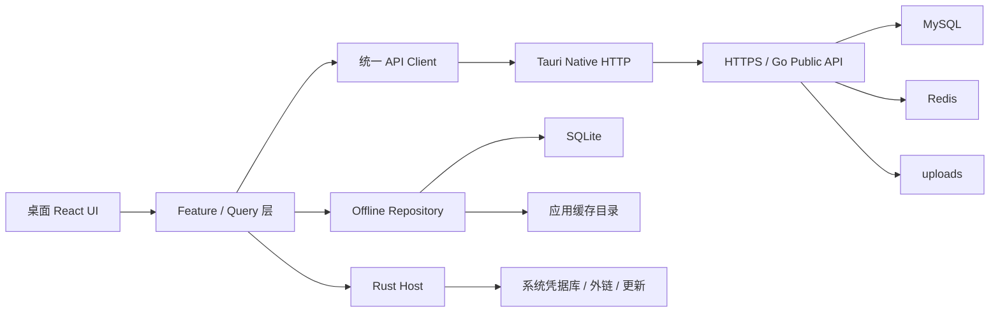

# 个人博客桌面客户端开发技术文档

> 文档状态：Draft v1.0  
> 编写日期：2026-07-14  
> 适用仓库：`personal-website`  
> 首发平台：Windows 10/11 x64

## 0. 结论

本项目要开发的是面向访客和注册读者的“个人博客桌面客户端”，不是后台管理工具，也不是把管理后台换一个窗口运行。

桌面端与网页端共享同一个 Go/Gin API、MySQL、Redis 和上传资源。网页发布新文章后，桌面端重新请求公开接口即可得到最新内容；桌面端不连接数据库，不复制后端业务，也不调用 `/api/admin/*`。

核心技术决策沿用现有桌面技术基线：

| 层次 | 选择 | 说明 |
| --- | --- | --- |
| 桌面容器 | Tauri 2 | 安装体积小，支持原生缓存、凭据库、更新和最小权限控制 |
| UI | React 18 + TypeScript + Vite | 与现有网页端技术栈一致，复用展示组件和设计变量 |
| 路由 | React Router 6 `createHashRouter` | 避免桌面协议下刷新和深链异常 |
| 样式 | 原生 CSS Variables + Lucide | 延续站点内容语义，同时针对宽屏阅读重排 |
| 服务端状态 | TanStack Query 5 | 管理请求缓存、后台刷新、重试和失效 |
| 本地数据 | SQLite + 应用缓存目录 | 保存离线文章、阅读记录、收藏和非敏感设置 |
| 用户凭据 | Windows Credential Manager/macOS Keychain | 用户会话不写入 localStorage、SQLite 或日志 |
| 远端通信 | Tauri 原生 HTTP + 统一 TypeScript Client | 请求现有 HTTPS Go API，不依赖网页同源路径 |
| 业务真相源 | 远端 Go API/MySQL | SQLite 只是缓存，不能反向覆盖服务器内容 |

## 1. 产品范围

### 1.1 MVP 功能

- 读者首页：个人资料、精选文章、精选项目、技能和站点统计。
- 博客：分页、分类、标签、关键词筛选和文章详情。
- 阅读器：Markdown/GFM、安全代码高亮、目录、阅读进度和字体设置。
- 全局搜索：文章、项目和技能结果跳转。
- 项目页：项目筛选、技术栈、源码和演示链接。
- 用户账户：注册、邮箱验证码、登录、重设密码和修改用户名。
- 评论：查看、发表、回复、在规则允许时编辑和删除自己的评论。
- 个性化：服务端主题、浅色/深色、本地字体与阅读宽度覆盖。
- 音乐与 Live2D：按服务端配置启用，资源按需加载并可在本地关闭。
- 离线阅读：用户主动下载公开 Markdown 文章及其安全图片资源。
- 收藏与历史：本地收藏、最近阅读和阅读位置恢复。
- Windows 安装包、诊断日志和签名自动更新准备。

### 1.2 非目标

- 文章、项目、主题、音乐、Live2D 或用户的后台管理。
- 调用 `/api/admin/*`、保存管理员 JWT 或展示运维数据。
- 桌面端直接访问 MySQL、Redis、SSH 或 Docker。
- 离线发布评论、离线同步账号资料或后台自动重放写请求。
- 给静态文章 iframe `allow-same-origin` 或 Tauri IPC 权限。
- 第一版提供完整 RSS 客户端、插件市场或多站点聚合。

## 2. 用户体验与 UI 架构

### 2.1 应用布局

第一版采用单主窗口、原生标题栏。推荐默认尺寸 `1360 x 860`，最小尺寸 `960 x 640`。

```text
┌──────────────────────────────────────────────────────────────┐
│ 返回/前进  站点名称              搜索  音乐  主题  账户     │
├──────────────┬───────────────────────────────┬───────────────┤
│ 首页         │                               │ 阅读目录/资料  │
│ 博客         │          主内容区             │ 音乐/Live2D   │
│ 项目         │                               │ （按页显示）   │
│ 收藏与历史   │                               │               │
├──────────────┴───────────────────────────────┴───────────────┤
│ 网络状态 · 最近同步 · 离线内容容量                           │
└──────────────────────────────────────────────────────────────┘
```

- 首页和项目页可使用宽内容区；文章页限制正文宽度，右侧显示目录。
- 窗口较窄时收起左侧导航，右侧区域变为抽屉，不缩放正文文字。
- Live2D 不能遮挡正文、评论、导航和播放器；小窗口默认隐藏。
- 音乐、Live2D、代码高亮均按路由懒加载，不能阻塞首屏。
- 使用既有博客品牌和远端主题，但桌面端布局不是网页 iframe。

### 2.2 路由

| 页面 | 路由 |
| --- | --- |
| 首页 | `/` |
| 博客列表 | `/blog` |
| 文章阅读 | `/blog/:id` |
| 项目 | `/projects` |
| 搜索 | `/search?q=` |
| 收藏 | `/library/favorites` |
| 阅读历史 | `/library/history` |
| 离线内容 | `/library/offline` |
| 登录、注册与用户账户 | `/account` |
| 设置 | `/settings` |

### 2.3 文章阅读器

- 使用 `react-markdown`、`remark-gfm`、`rehype-highlight` 和 `rehype-sanitize`。
- 标题生成稳定锚点，右侧目录跟随滚动；每 2 秒节流保存阅读位置。
- 提供固定档位的字号、行高和阅读宽度，不随视口连续缩放字体。
- 支持复制代码、系统浏览器打开外链、图片查看和回到顶部。
- 密码文章显示解锁界面；密码不持久化，解锁后的正文默认不进入离线库。
- `contentType=static` 的文章在 sandbox iframe 中显示服务端签名 URL；不设置 `allow-same-origin`，且不向子 frame 暴露 Tauri IPC。

## 3. 总体架构



### 3.1 数据同步原则

1. 后台或网页管理端把内容写入远端 MySQL。
2. 后端变更后清理公开 Redis 缓存。
3. 桌面端在启动、窗口重新聚焦、手动刷新和缓存到期时请求 Public API。
4. 成功响应更新 TanStack Query 和允许持久化的 SQLite 快照。
5. 请求失败时展示最近一次缓存，并明确标记“离线内容”和缓存时间。

桌面端不做双向内容同步。用户侧评论和账号修改是实时 API mutation；只有服务器成功响应后才在 UI 中确认成功。

### 3.2 推荐目录

```text
desktop-blog/
├─ src/
│  ├─ app/                 # 路由、Provider、AppShell
│  ├─ api/                 # client、DTO、query keys、错误类型
│  ├─ features/
│  │  ├─ home/
│  │  ├─ articles/
│  │  ├─ projects/
│  │  ├─ search/
│  │  ├─ account/
│  │  ├─ comments/
│  │  ├─ music/
│  │  ├─ live2d/
│  │  └─ library/
│  ├─ components/          # 无业务副作用的共享组件
│  ├─ local/               # SQLite repository 与 migration
│  └─ styles/              # tokens、全局样式
├─ src-tauri/
│  ├─ src/                 # 凭据、HTTP bridge、缓存、日志、更新
│  ├─ capabilities/
│  └─ tauri.conf.json
└─ tests/
```

不要从 `desktop-blog/src` 通过相对路径导入 `frontend/src`。稳定的纯组件、DTO 和 Markdown 规则后续再提取到 `packages/`。

## 4. 现有 API 对照

桌面客户端使用现有接口即可完成 MVP：

| 功能 | 方法与接口 | 登录要求 |
| --- | --- | --- |
| 首页 | `GET /api/public/home?lang=zh` | 否 |
| 资料/统计 | `GET /api/public/profile`、`GET /api/public/stats` | 否 |
| 文章列表 | `GET /api/public/articles?page=0&size=10&tag=&category=&q=` | 否 |
| 文章详情/解锁 | `GET /api/public/articles/:id`、`POST .../:id/unlock` | 否 |
| 评论列表 | `GET /api/public/articles/:id/comments` | 否 |
| 标签/分类 | `GET /api/public/tags`、`GET /api/public/categories` | 否 |
| 项目/技能 | `GET /api/public/projects`、`/skills`、`/feature-cards` | 否 |
| 搜索 | `GET /api/public/search?q=` | 否 |
| 主题/背景 | `GET /api/public/theme`、`/theme/background-images` | 否 |
| Live2D | `GET /api/public/live2d-model` | 否 |
| 音乐 | `GET /api/public/music`、流和歌词接口 | 是 |
| 注册/登录 | `POST /api/user-auth/code|register|login|password/reset` | 否 |
| 当前用户 | `GET /api/account/me` | 是 |
| 退出/用户名 | `POST /api/account/logout`、`PUT /api/account/username` | 是 |
| 评论写操作 | `POST /api/user/comments`、`PUT/DELETE /api/user/comments/:id` | 是 |

客户端要适配现有分页结构 `content/totalElements/totalPages/size/number`，并统一解析 `{ message, requestId? }` 错误。搜索关键字至少 2 个字符；文章列表 `size` 最大为 20；评论 `size` 最大为 50。

## 5. 用户会话

当前普通用户登录接口只通过 `HttpOnly + SameSite=Strict` Cookie 建立会话，响应正文不返回用户 token。虽然后端受保护中间件支持 `Authorization: Bearer <user-token>`，桌面端无法从 HttpOnly Cookie 安全取得这个 token；仅增加 CORS 也不能解决 SameSite 限制。

公开阅读 MVP 不需要用户会话。要实现桌面登录、评论写入和受保护音乐，需要后端新增受控的桌面认证契约：

1. 使用 `POST /api/user-auth/desktop/login` 返回短期 user access token；当前实现无 refresh token，过期后重新登录。
2. Rust 宿主把 token 保存到系统凭据库，React 层只调用受控请求 command，不接触 token。
3. 需要登录的 API 由 Rust 添加 Bearer Header；启动时调用 `/api/account/me` 验证。
4. 音乐 `<audio>` 无法添加 Authorization，还需由服务端调整签名流授权，或由原生层实现支持 Range 的受控媒体代理。
5. 退出时调用服务端 logout/revoke，并删除本地凭据。

禁止通过脚本读取 HttpOnly Cookie，也禁止把 token 写入 localStorage、SQLite、URL、崩溃报告或日志。

## 6. 本地缓存与离线阅读

### 6.1 SQLite 最小模型

```sql
CREATE TABLE cache_entries (
  cache_key TEXT PRIMARY KEY,
  kind TEXT NOT NULL,
  resource_id TEXT,
  language TEXT,
  payload_json TEXT NOT NULL,
  fetched_at INTEGER NOT NULL,
  expires_at INTEGER NOT NULL
);

CREATE TABLE reading_state (
  article_id INTEGER PRIMARY KEY,
  scroll_ratio REAL NOT NULL DEFAULT 0,
  last_read_at INTEGER NOT NULL,
  favorite INTEGER NOT NULL DEFAULT 0
);

CREATE TABLE offline_articles (
  article_id INTEGER PRIMARY KEY,
  article_json TEXT NOT NULL,
  updated_at TEXT NOT NULL,
  downloaded_at INTEGER NOT NULL,
  bytes INTEGER NOT NULL DEFAULT 0
);

CREATE TABLE offline_assets (
  article_id INTEGER NOT NULL,
  remote_url TEXT NOT NULL,
  local_path TEXT NOT NULL,
  bytes INTEGER NOT NULL,
  PRIMARY KEY (article_id, remote_url)
);
```

### 6.2 缓存规则

- 首页、文章摘要、项目、技能、主题：stale-while-revalidate，默认可陈旧 24 小时。
- 普通文章正文：在线缓存 24 小时；只有用户点击“下载离线”后才长期保留。
- 离线下载用 Markdown AST 提取图片 URL，通过 Rust 下载到应用缓存目录并重写为受控本地协议。
- 仅缓存 HTTPS 且属于已配置站点/资源白名单的图片；拒绝 `file:`、`javascript:`、`data:text/html` 等 scheme。
- 密码文章、登录响应、账户数据、评论写请求、音乐签名 URL 不进入持久缓存。
- 静态站点文章和 Live2D 第一版不保证离线；音乐只流式播放，不做永久下载。
- 默认离线资源上限 500 MB，使用 LRU 清理；用户主动下载的文章先提示再删除。
- 服务器 `updatedAt` 变化时标记离线副本有更新，由用户在线刷新；本地副本永不上传服务器。

## 7. 主题、音乐与 Live2D

- 远端 `/api/public/theme` 是品牌主题基线；桌面设置只允许浅/深色、字号、动效和背景开关等本地覆盖。
- 服务端主题更新后刷新 Query 缓存；离线时使用最近一次安全主题，无缓存则使用内置中性主题。
- 音乐功能仅在用户登录后加载播放列表；流 URL 过期或 401 时刷新列表一次，不无限重试。
- 播放状态放在 AppShell，路由切换不中断；退出登录立即停止受保护流并清除内存 URL。
- Live2D 必须提供关闭开关，遵从 `prefers-reduced-motion`，窗口失焦或最小化时暂停渲染。
- Live2D 模型资源只允许来自配置的 HTTPS 服务端，离开页面时释放纹理、事件和 canvas。

## 8. 安全与权限

- 正式构建只允许连接固定生产 HTTPS Origin；开发构建单独允许 `http://127.0.0.1`。
- CSP 明确列出 API、图片、音频和 Live2D 来源，不使用 `default-src *`。
- Tauri capability 只开放 HTTP、凭据、受控缓存目录、外链和更新所需权限。
- 所有 Markdown 经过 sanitize；外链只允许 `http/https/mailto` 并交给系统浏览器。
- 静态文章只在无 `allow-same-origin` 的 sandbox iframe 或系统浏览器打开，不共享 Tauri IPC 权限。
- 日志只记录方法、路径模板、状态码、耗时和 request ID，不记录 Cookie、Bearer、密码、评论正文或完整邮箱。
- 遵从服务端 429 与 `Retry-After`；搜索 debounce 300 ms，并取消过期请求。

## 9. 服务器要求

现有公开 API 已覆盖首页、文章、项目、搜索、主题、评论读取和 Live2D，所以开发与上线“公开阅读版”**不需要更新后端，也不需要新增数据库表**。

桌面用户登录、评论写入和受保护音乐已经由本仓库最新 Go 后端实现。生产服务器必须部署这次后端更新；旧服务器仍可用于公开阅读，但桌面登录会返回 404。这不是 CORS 配置问题，不能只靠 Nginx 响应头解决。

服务器只需满足：

- 已部署当前仓库中上述 Public/User/Account API。
- 使用有效 HTTPS 证书，Nginx 正常转发 `Authorization`、`Set-Cookie` 和 Range 请求。
- 公网只开放 80/443，不开放 MySQL、Redis 和 Go 内部端口。
- 邮件注册/重设密码功能已配置 SMTP。
- 上传资源 URL 能从公网 HTTPS 访问。
- 音频代理支持 Range 和足够的读取超时。

`GET /api/meta`、统一 `requestId` 和自动更新 manifest 属于兼容性与诊断增强；缺少它们不会阻塞公开博客 MVP。若生产服务器版本早于当前 Public/User API，则只需部署当前 Go 服务，不需要为桌面端另建后端。

## 10. 测试与验收

### 10.1 自动化测试

| 层次 | 工具 | 重点 |
| --- | --- | --- |
| TypeScript 单元测试 | Vitest | DTO、URL、缓存 TTL、Markdown 链接和错误映射 |
| React 组件测试 | Testing Library + MSW | 首页、文章、离线状态、登录、评论和播放器 |
| Rust 测试 | `cargo test` | Origin 白名单、Cookie 解析、凭据、路径和缓存清理 |
| Web E2E | Playwright | 导航、搜索、阅读、登录、评论和离线回退 |
| 打包烟雾测试 | Tauri WebDriver/人工 | 安装、启动、重启会话、外链、更新和卸载 |

最低门禁：

```text
npm run lint
npm run typecheck
npm run test
npm run build
cargo fmt --check
cargo clippy -- -D warnings
cargo test
```

### 10.2 MVP 验收标准

- 首屏是公开博客首页，不出现后台导航或管理员登录。
- 首页、博客、文章、项目和搜索均读取真实生产 Public API。
- 网页端发布或修改内容后，桌面端刷新能看到相同数据。
- 普通文章可下载并在断网后打开，正文图片有明确的可用/缺失状态。
- 登录后可查看账户、播放音乐和完成评论增删改；重启后可安全恢复会话。
- 密码文章未解锁时不泄露摘要和正文，密码及正文不被持久化。
- API 不可用时不白屏，显示缓存时间、离线状态和重试入口。
- 浅色/深色、最小窗口、125%/150% DPI、键盘导航和 reduced motion 可用。
- 生产包不包含任意网络、任意文件或任意 shell 权限。

## 11. 实施顺序

1. 创建独立 `desktop-blog/` Tauri 2 + React + TypeScript 工程和最小权限配置。
2. 实现 AppShell、路由、设计变量、错误边界和生产 Server Profile。
3. 建立 API Client、DTO、MSW、Query Key 和 Public API 契约测试。
4. 交付首页、博客列表、文章阅读、项目和搜索完整主链路。
5. 增加 SQLite migration、阅读历史、收藏和离线文章/资源下载。
6. 实现 Rust 会话 bridge、系统凭据、登录注册、账户和评论。
7. 接入远端主题，再按需加载音乐和 Live2D，并完成资源释放与降级。
8. 完成 Windows 图标、安装包、代码签名、自动更新和打包烟雾测试。

每个阶段都必须交付可运行的纵向切片。不得先批量复制网页页面，再在最后补通信、安全和离线能力。

---

本规格替代“桌面端默认是后台管理工具”的产品假设。后台管理端可作为另一个独立产品保留，但公开博客客户端的入口、路由、权限、数据缓存和验收均以读者体验为准。
